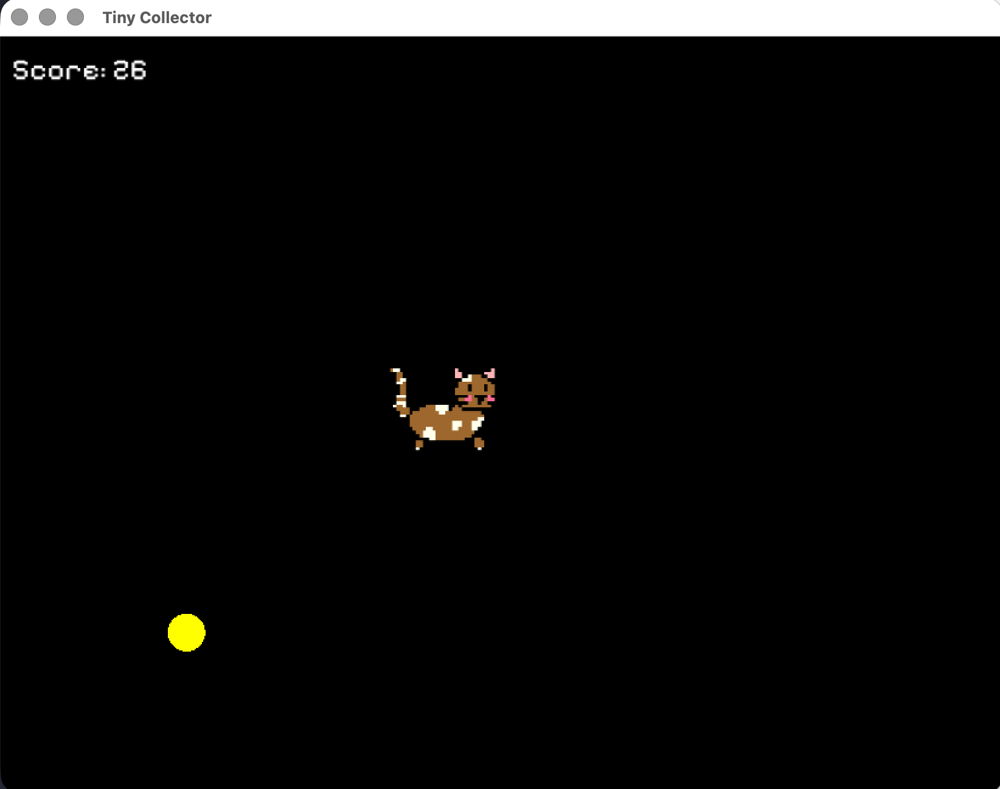

# Tiny Collector


Tiny Collector is a small experimental 2D game built in C++ using SFML.  
The project exists primarily as a learning exercise to explore C++, game architecture, and basic game design principles.

The idea behind the project is simple: build a small playable system while gradually experimenting with different game programming concepts such as entities, state machines, collision detection, and rendering.

The game itself is intentionally minimal and serves mainly as a sandbox for learning and iteration.

---

## Current Gameplay



The player controls a pixel-art cat that collects coins on the screen.

Features currently implemented:

- Player movement with keyboard input
- Coin spawning and collision detection
- Score tracking
- Game state system (Menu / Playing / Game Over)
- Entity-based architecture
- Basic world bounds
- Sprite flipping based on movement direction

The player sprite (the cat) was drawn manually in pixel art for this project.

---

## Technical Goals

This repository is not intended as a polished game.  
Instead, it focuses on learning and experimenting with core concepts such as:

- C++ project structure
- Object-oriented design
- Entity systems
- Game loops
- State machines
- Input handling
- Rendering with SFML
- Basic game mechanics

The project will likely evolve over time as new systems are explored.

---

## Tech Stack

- **Language:** C++
- **Graphics Library:** SFML
- **Build System:** CMake
- **Platform:** macOS (currently)

---

## Project Structure

```bash
src/
├── Entity
├── Player
├── Coin
├── Game
└── main.cpp
assets/
└── sprites and fonts
```

The architecture is centered around a simple **Entity-based design**, where game objects share a common interface and are managed by the main game loop.

---

## Running the Project

#### Clone the repository:

```bash
git clone https://github.com/yourusername/tiny-collector.git
cd tiny-collector
```

#### Build the project:

```bash
mkdir build
cd build
cmake ..
make
```

#### Run the game:

```bash
./game
```

---

## Future Experiments

Some ideas planned for future iterations:

- Sprite animations
- Particle effects
- Sound effects
- Improved entity systems
- Timed gameplay modes
- Additional game mechanics

## License

MIT License © 2026 Setayesh Golshan
